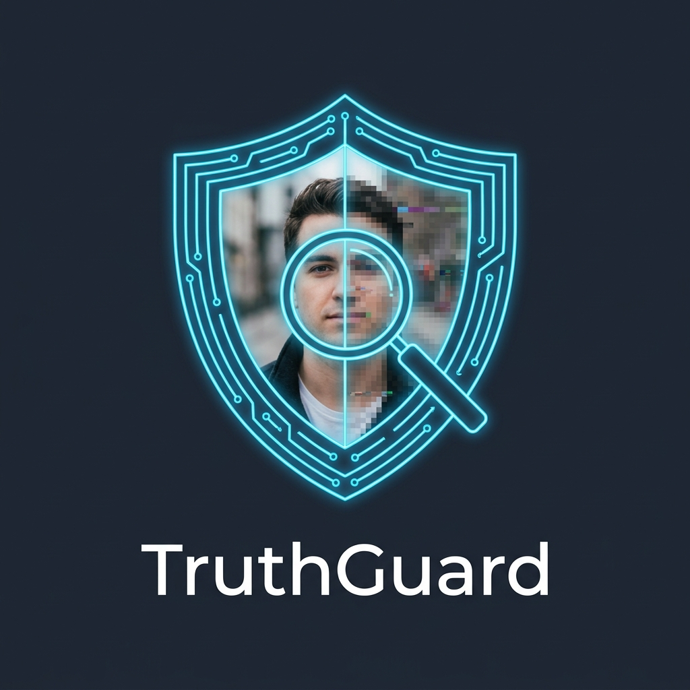
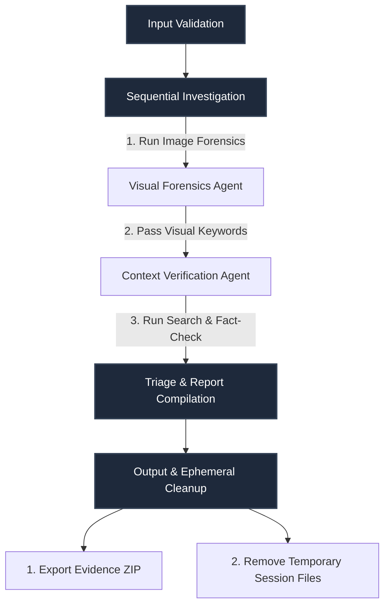

# TruthGuard



TruthGuard is an advanced visual forensics and context verification system built on the **Google Agent Development Kit (ADK) 2.0** and powered by the Gemini model family. It orchestrates a multi-agent workflow to verify the authenticity of visual media and cross-reference associated textual claims against real-time web sources.

---

## Key Features

*   **Deep Visual Forensics:** Analyzes uploaded images (JPEG, PNG, WEBP) against a strict 7-point digital forensics checklist (evaluating facial geometry, lighting direction, background edges, hand anatomy, compression artifacts, reflection plausibility, and overall coherence) to identify splicing, copy-paste edits, or synthetic AI generation.
*   **EXIF & Metadata Extraction:** Scans underlying file headers for software signatures (e.g., Photoshop, Canva), creation date conflicts, and format inconsistencies to flag metadata tampering.
*   **Real-Time Context Grounding:** Decomposes paired claims into atomic sub-claims, searches the web in parallel, and performs consolidated validation to classify each statement as `SUPPORTED`, `CONTRADICTED`, or `UNVERIFIABLE`.
*   **Automated Triage Matrix:** Calculates a Unified Harm Severity Score ($0\text{--}100$) and maps the incident to a specific risk level (`Critical`, `High`, `Medium`, `Low`) and harm category (e.g., *Political Misinformation*, *Financial Fraud*, *Public Safety Risk*, *Identity Impersonation*).
*   **Forensic Chatbot Assistant:** Features an in-dashboard, session-aware chatbot to answer follow-up queries about visual anomalies or cited fact-check search results.
*   **Secure Evidence Bundling:** Automatically packages the final report, source media, and audit logs into a timestamped, compliance-ready ZIP archive.
*   **Privacy-First Design:** Implements automatic PII scrubbing on all outgoing claims and enforces zero-persistence ephemeral session folders.

---

## Workflow Architecture

TruthGuard executes a structured 4-stage pipeline coordinated via [app/agents/coordinator.py](file:///c:/Users/varad/.gemini/antigravity-ide/scratch/truthguard/app/agents/coordinator.py):



1.  **Input Validation:** Confirms file integrity, size constraints (max 10MB), safe extension matches, and generates a unique session token.
2.  **Sequential Investigation:** First runs visual forensics to scan for synthetic face and structural anomalies. Any detected visual subjects/keywords are forwarded to the context verification agent to increase query relevance during factual search.
3.  **Triage & Report Compilation:** Fuses visual anomaly confidence with web fact-check grounding to evaluate harm metrics and output recommended mitigation workflows.
4.  **Output & Cleanup:** Builds the compliance evidence package and purges all media files from local memory to prevent data leaks.

---

## Project Structure

```text
truthguard/
  ├── app/
  │    ├── agents/
  │    │    ├── coordinator.py           # Main orchestration engine & graph execution
  │    │    ├── visual_forensics.py      # Vision model analysis & checklist checker
  │    │    ├── context_verification.py  # Claim decomposition & factual grounding
  │    │    └── triage_report.py         # Harm severity scoring & mitigation logic
  │    ├── tools/
  │    │    ├── image_utils.py           # File validation, formats, & base64 encoding
  │    │    ├── metadata_extractor.py    # EXIF/EXIF-tag analysis
  │    │    ├── evidence_bundle.py       # Compliance ZIP aggregator & archiving
  │    │    └── web_search_mcp.py        # Web search engine connector
  │    ├── models/
  │    │    └── report_schema.py         # Structured Pydantic response models
  │    └── utils/
  │         ├── security.py              # PII scrubber & session directory manager
  │         ├── gemini_client.py         # Consolidated API interface & safety gates
  │         └── logger.py                # Structured system logging
  ├── tests/
  │    ├── test_security.py              # Security & scrubber tests
  │    ├── test_gemini_client.py         # Central client integration tests
  │    ├── test_visual_forensics.py      # Image analysis tests
  │    ├── test_context_verification.py  # Fact-check & search tests
  │    └── test_triage_report.py         # Scoring & report generation tests
  ├── test_images/                       # Local directory containing test-suite assets
  ├── CONTEXT.md                         # Project development policies & standards
  ├── streamlit_app.py                   # Streamlit Frontend Triage Dashboard
  ├── download_test_images.py            # Local test library installer
  ├── verify_test_library.py             # Integrity validator for downloaded assets
  └── requirements.txt                   # Project package dependencies
```

---

## Getting Started

### 1. Prerequisite Environment
Create and configure your local workspace environment:
```bash
# Clone the repository and navigate to root
cd truthguard

# Install dependencies
pip install -r requirements.txt

# Create environment configuration
copy .env.example .env
```
Open `.env` and configure your API credentials and model configuration:
```env
GEMINI_API_KEY="your_api_key_here"
```

### 2. Populate and Verify the Test Library
TruthGuard features an automated script to download clean real/synthetic sample images for triage calibration:
```bash
# Download calibrated visual forensics assets
python download_test_images.py

# Verify folder structures and image file integrity
python verify_test_library.py
```

### 3. Launch the Streamlit Frontend Dashboard
Start the interactive UI dashboard:
```bash
streamlit run streamlit_app.py
```

### 4. Running Tests
Verify that all agents, tools, and security functions are operating as intended:
```bash
pytest
```

---

## Compliance & Standards

TruthGuard is architected to operate under strict compliance policies detailed in [CONTEXT.md](file:///c:/Users/varad/.gemini/antigravity-ide/scratch/truthguard/CONTEXT.md):
*   **Structured Output Only:** Sub-agents return deterministic Pydantic schemas or formatted JSON payloads rather than unstructured text.
*   **PII Sanitization:** High-risk strings (emails, names, phone numbers) are scrubbed at the gateway before sending requests to public LLM endpoints.
*   **Data Ephemerality:** Subject images and intermediate file assets are processed strictly in memory/ephemeral storage and scrubbed immediately on completion.
